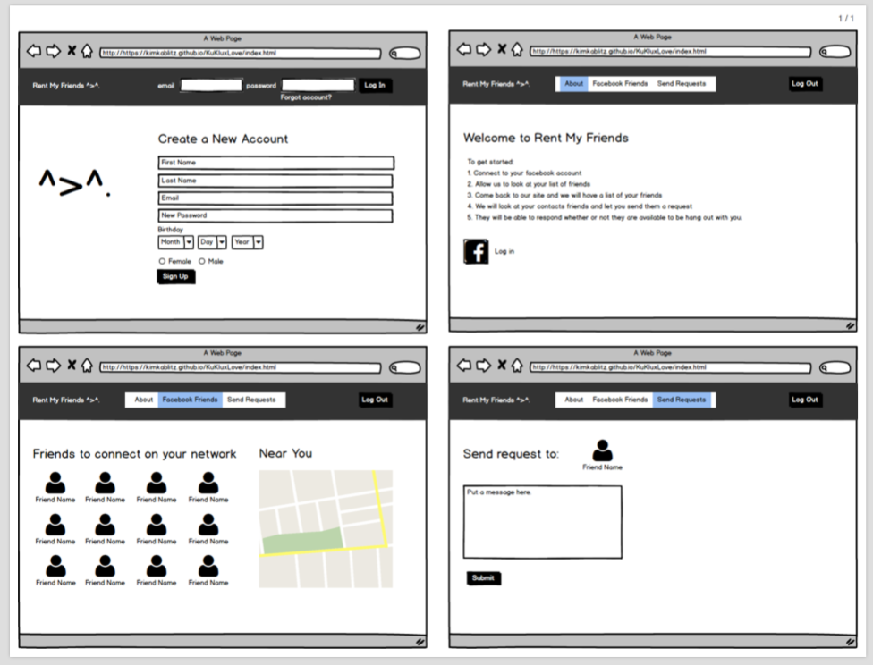

# Group-Project
Kelvin, Lakshmi, Kimmy

## Project Tittle

Friendable

## Team Member
* Lakshmi Strom
* Kimmy Kablitz
* Kelvin Paje
  
## Project Description

Using facebook API to access friends list and see their availability via google calendar and their locations via googlemaps.
An interface to make money off your available friends on facebook

## Sketch of Final Product

## APIs to be Used
* GoogleMaps
* Location
* FireBase
* Facebook API

## Rough Breakdown of Tasks

* Connect to Firebase and update list of facebook friends.
* Login page via Facebook, accessing to Messenger
* Intergrate Googlemaps to locate nearby friends.
* Make UI for the app
  

